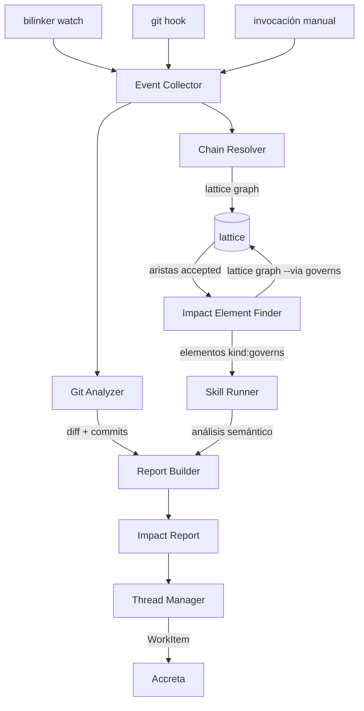
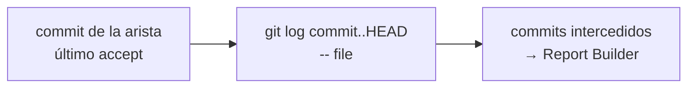
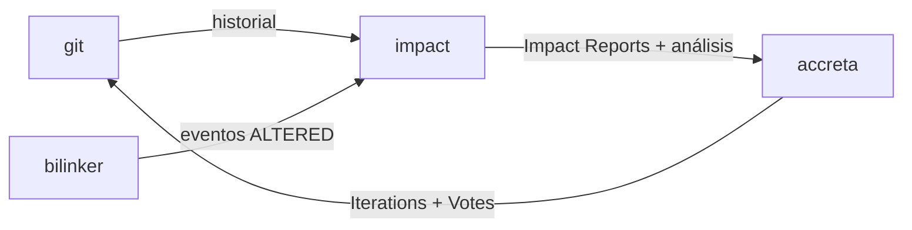

# El flujo

Impact es la consultora autónoma de impacto de cambios del ecosistema. Parte de los eventos de drift que detecta bilinker, los cruza con los [elementos de impacto](impact-element.md) declarados en el grafo, y produce evaluaciones semánticas accionables: un [Impact Report](impact-report.md), y un [thread](thread.md) donde se discute.

## Flujo general



## Componentes internos

### El Event Collector normaliza los eventos de todas las fuentes

Recibe eventos de múltiples fuentes —`bilinker watch`, un git hook, una invocación manual— y los normaliza en un formato uniforme: `{ file, kind: Modified|Created|Deleted, commit? }`.

### El Chain Resolver pregunta a lattice qué aristas alcanzan un archivo

Dado un archivo, consulta `lattice graph <archivo> --via bilink` para obtener las aristas que lo alcanzan, con sus nodos, `state` y `commit`.

No lee archivos `.bilink` ni resuelve paths Stratum: lattice entrega las aristas ya resueltas entre capas.

### El Impact Element Finder pregunta a lattice quién gobierna un vínculo

Dado un vínculo afectado, consulta `lattice graph <uuid> --via governs` para encontrar los elementos con `kind: governs` que lo gobiernan. Cada uno declara un documento de decisión.

Las aristas `governs` son no dirigidas: recorrerlas desde el vínculo afectado da sus gobernantes sin necesidad de un índice de backlinks.

### El Git Analyzer lee los commits que intercedieron desde el anchor

Lee el historial de git para obtener los commits que modificaron el archivo desde el último estado conocido. El ancla es el `commit` que trae la arista: todo lo posterior son los commits que intercedieron en el cambio.



### El Skill Runner ejecuta una skill por elemento de impacto encontrado

Para cada elemento de impacto encontrado, ejecuta la [skill](skills.md) configurada para su layer, o la skill por defecto. Recibe el documento de decisión, el bilink afectado, los commits intercedidos y el blast radius. Produce un análisis semántico como texto.

### El Report Builder combina las tres salidas en un Impact Report

Combina la salida del Chain Resolver, el Git Analyzer y el Skill Runner para construir un [Impact Report](impact-report.md) estructurado.

### El Thread Manager lleva los hilos, cada uno en su propia carpeta

Gestiona los hilos de discusión. Cada [thread](thread.md) vive en su propia carpeta bajo `.impact/threads/`.

## Posición en el ecosistema

```
git          ← fuente de verdad del historial
bilinker     ← detecta drift entre capas linkedeadas
lattice      ← agrega las conexiones del proyecto en un grafo único
impact       ← evalúa coherencia con decisiones declaradas
accreta      ← gobierna la resolución del cambio
```



### Impact consulta el grafo a través de lattice

Impact consulta el grafo del proyecto a través de lattice en vez de recorrer los `.bilink` por su cuenta: el blast radius es una consulta sobre el grafo agregado, y las aristas ya llegan con su `state` y su `commit`. No lee archivos `.bilink`, no resuelve paths Stratum y no habla con language servers.

| Pregunta de impact | Consulta |
|---|---|
| ¿Qué cadenas referencian este archivo? | `lattice graph <archivo> --via bilink` |
| ¿Qué documentos gobiernan este vínculo? | `lattice graph <uuid> --via governs` |
| ¿Cuál es el blast radius de este cambio? | `lattice graph <archivo> --both --guarantee accepted` |
| ¿Qué specs alcanza el cambio subiendo por llamadas? | `lattice graph <archivo> --up --via bilink,governs,call` |
| ¿Cuál es el baseline para el diff? | el campo `commit` de la arista alcanzada |

Todas devuelven aristas con `kind`, `guarantee`, `state` y `commit`, como las define la spec de lattice para sus aristas.

## Principios de diseño

### Declarativo

Los elementos de impacto declaran la gobernanza upfront, no post-hoc.

### Basado en hechos

Toda evaluación parte de diffs, commits y hashes concretos.

### Orquesta, no escribe

Puede invocar a las herramientas dueñas de cada formato —bilinker, lattice—, y no escribe sus archivos ni parsea sus formatos.

### Componible

Invocable manualmente, por hooks de git, o por `bilinker watch`.

### Autónomo por layer

Cada layer tiene sus propios elementos y skills sin necesitar el árbol completo.

## Persistencia

```
layer/
  .bilink/
    <uuid>.bilink           ← elementos de impacto (kind: governs) junto al resto
  .impact/
    reports/
      <uuid>.impact
    threads/
      <uuid>/
        thread.md            ← metadata: estado, título, bilinks afectados
        messages/
          0001.md            ← mensaje inicial (el Impact Report)
          0002.md            ← análisis de skill o respuesta humana
          0003.md
  .impact.toml               ← configuración de skills (opcional)
```

### Los elementos de impacto viven en `.bilink/`, y `.impact/` sólo lleva los artefactos

Los elementos de impacto viven en `.bilink/` como cualquier otro bilink, no en `.impact/`. `.impact/` contiene solo los artefactos de análisis y discusión.

### Todos los archivos son texto plano con frontmatter YAML y cuerpo Markdown

Legibles y diffables en git, sin base de datos.
