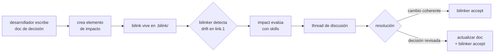

# Elemento de impacto

Un elemento de impacto es un bilink con `kind: governs` que declara que un documento de decisión gobierna o afecta a un vínculo estructural entre capas.

## Estructura

```
# .bilink/<uuid>.bilink
link.0: docs/adr/design-voting-machine.md
link.1: .bilink/7f3d8e9a-1b2c-4d5e-8f6a-7b8c9d0e1f2a.bilink

kind:   governs
name.0: architecture-decision
name.1: spec-impl-bridge

hash.0: b1c2d3e4...
commit.0: d4e5f6a7...
hash.1: e5f6a7b8...
commit.1: f7a8b9c0...
state.0: OK
state.1: OK
resolved_at: 2026-05-29T09:00:00Z
```

### `link.0` apunta al documento de decisión

ADR, test spec, documento de arquitectura, descripción de tecnología concreta, o cualquier documento que exprese una decisión con impacto sobre la relación entre capas.

### `link.1` apunta a un bilink estructural existente

El vínculo entre capas que este documento gobierna.

## Relación ternaria

### Un elemento de impacto genera una relación ternaria implícita en el grafo

```
docs/adr/design-voting-machine.md
        ↕ (elemento de impacto)
specs/voting.yaml ↔ impl/Voting.java
        (bilink estructural)
```

Esto enriquece el grafo que traversan las herramientas: no solo "A está vinculado a B", sino "A está vinculado a B y este documento de decisión lo gobierna".

## Dónde vive

### El elemento de impacto vive en `.bilink/` de la layer donde reside el documento de decisión

El bilink gobernado (`link.1`) puede estar en cualquier layer.

## Descubrimiento

### Quién gobierna a un vínculo se encuentra recorriendo las aristas `governs` desde él

Cuando bilinker detecta `ALTERED` o `CHAIN_DIRTY` en un vínculo, impact pregunta por los elementos que lo gobiernan:

```
lattice graph <uuid> --via governs
```

Las aristas `governs` son no dirigidas, así que encontrar "quién gobierna a X" es recorrerlas desde X: no hace falta un índice de backlinks. Lattice usa `.bilink/index/index` cuando está disponible para resolver el lookup en O(1), y cae a scan O(N) si no.

## Ciclo de vida



## `name.N` como contexto semántico

### `name.0` y `name.1` etiquetan el rol de cada extremo, y son opcionales

Los campos `name.0` y `name.1` etiquetan el rol de cada extremo en la relación. Son opcionales pero recomendados: permiten que las skills interpreten la relación sin leer el documento completo.

Ejemplos habituales:

| `name.0` | `name.1` |
|----------|----------|
| `architecture-decision` | `spec-impl-bridge` |
| `test-spec` | `implementation` |
| `technology-choice` | `dependency` |
| `invariant` | `enforcement-point` |

## Invariantes

### `kind: governs` implica que `link.1` es siempre un path `.bilink/<uuid>.bilink`

### El documento en `link.0` debe existir localmente

Es lo que `bilinker check` valida; si no existe, `state.0: DELETED`.

### El bilink gobernado en `link.1` puede estar en una layer no clonada localmente

En ese caso `state.1: UNREACHABLE`, sin considerarse error.

### Un bilink estructural puede tener múltiples elementos de impacto que lo gobiernan

Cada uno con su propio UUID.
